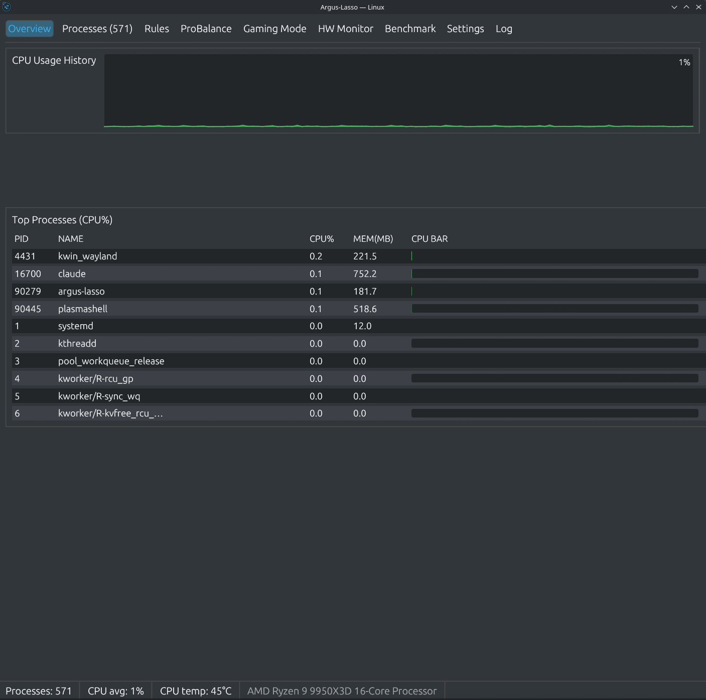
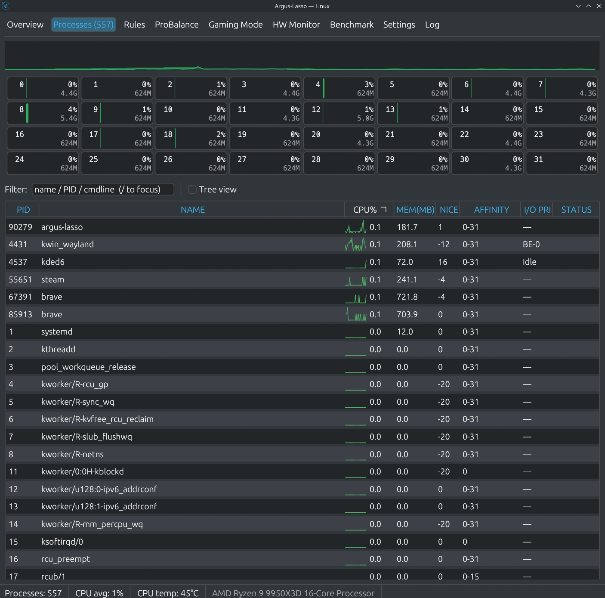
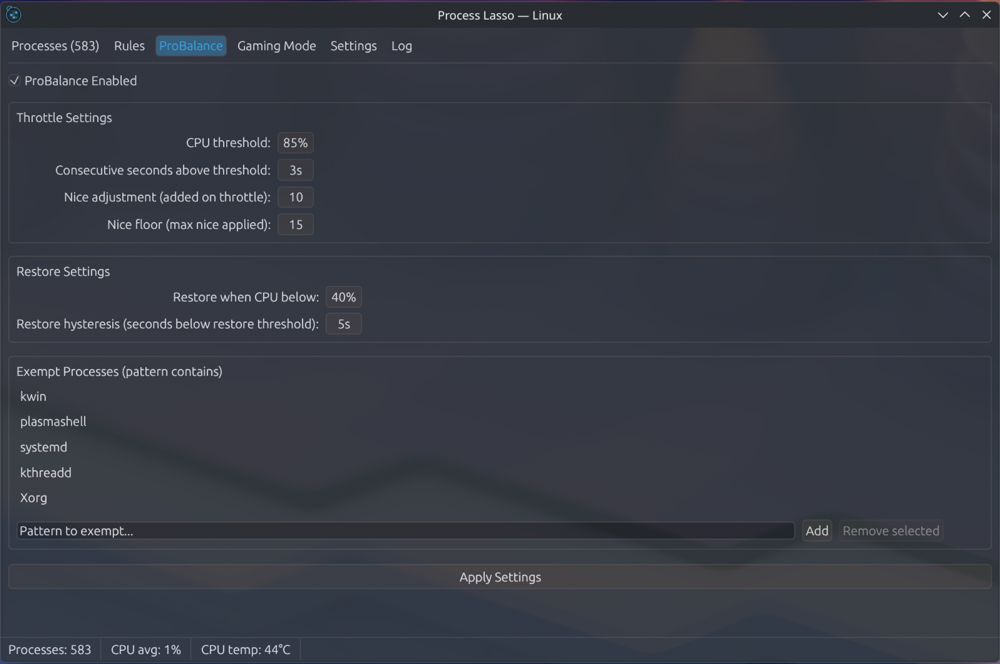
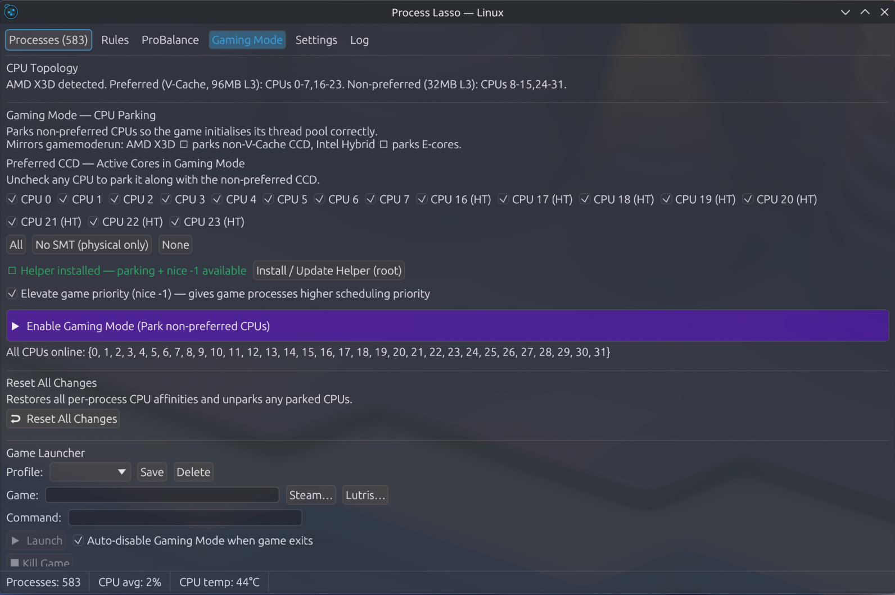
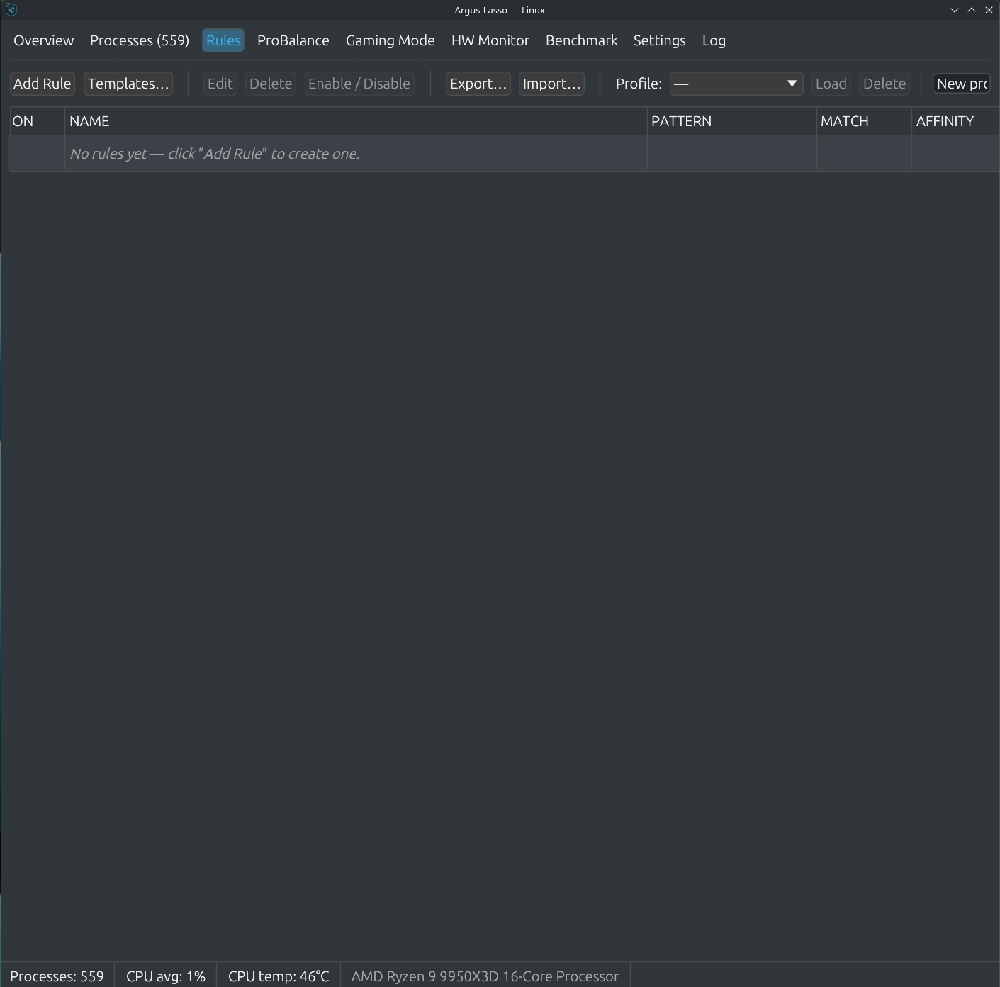
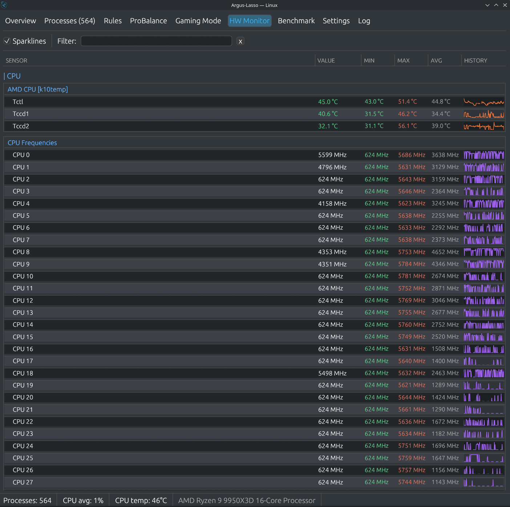
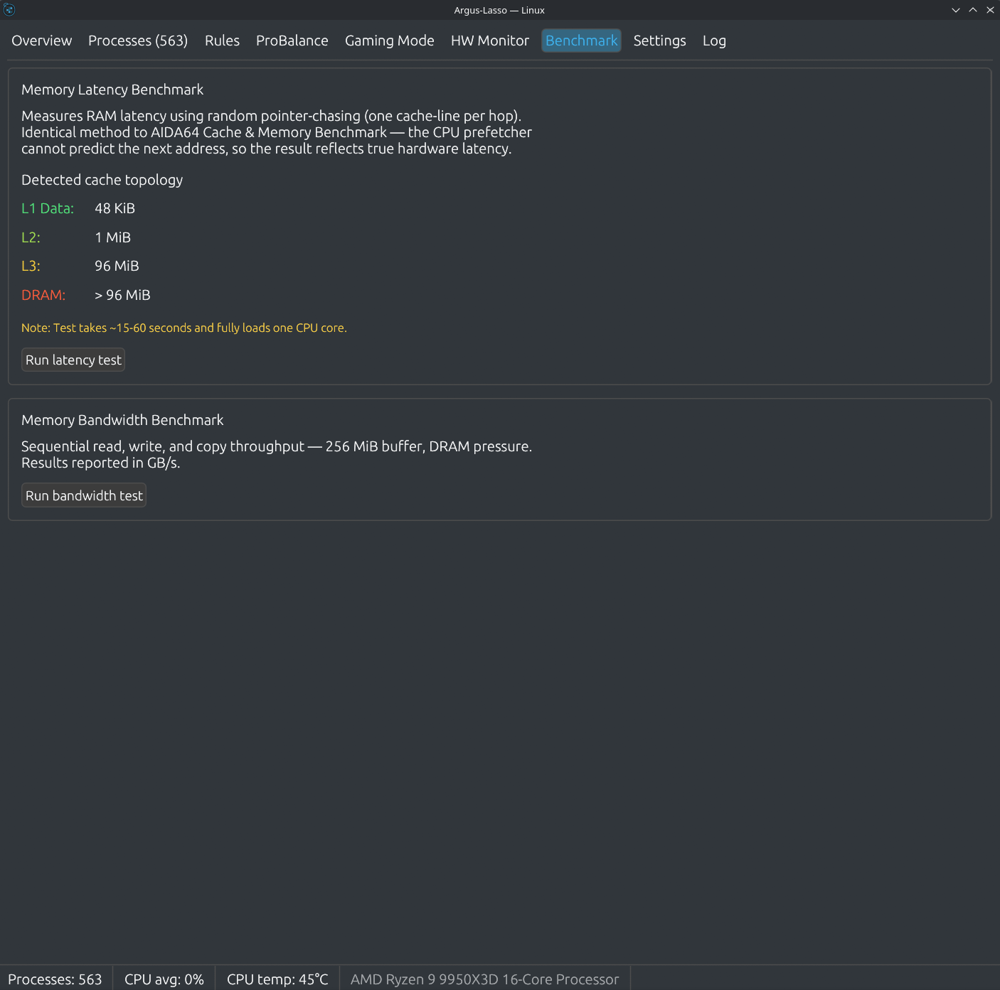
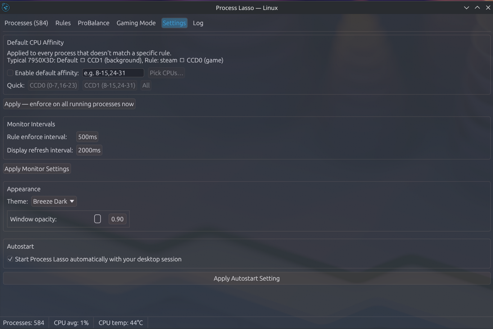
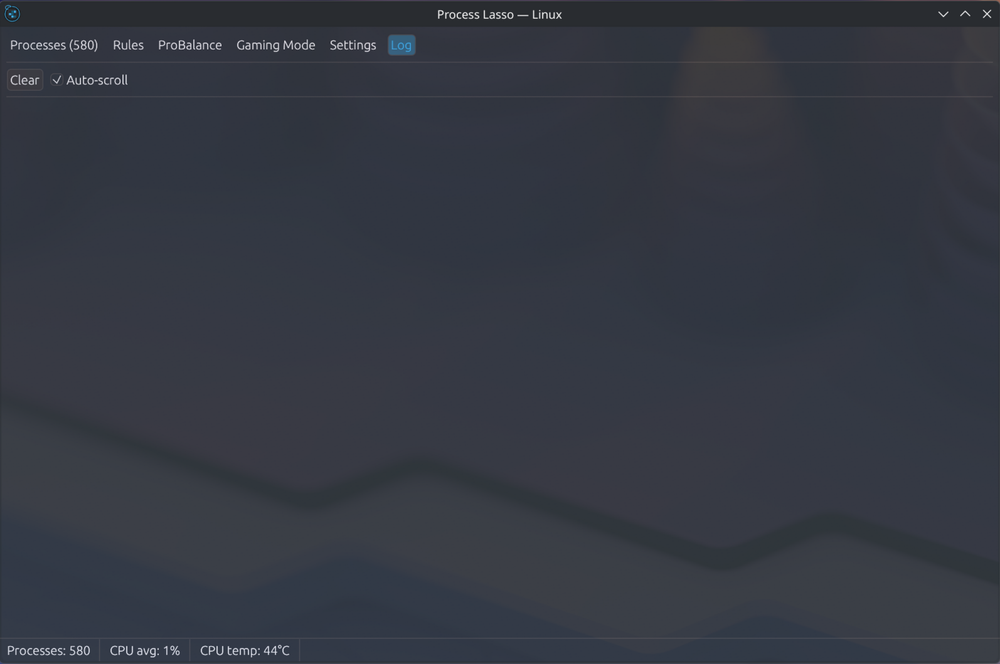

# Argus-Lasso

[](https://github.com/franzjeger/process-lasso-linux-rs/actions/workflows/ci.yml)
[](https://github.com/franzjeger/process-lasso-linux-rs/actions/workflows/audit.yml)
[](https://github.com/franzjeger/process-lasso-linux-rs/releases/latest)

A native Linux process manager written in Rust with an immediate-mode GUI (egui/eframe).
Inspired by Windows Process Lasso, rebuilt from scratch for Linux with KDE/Wayland first-class support — and significantly expanded in scope.



---

## Features

### Overview Dashboard
- System-wide CPU history graph (filled area chart)
- RAM usage bar with used/total
- Load average (1m / 5m / 15m)
- Top-10 processes by CPU in a live table

### Process Table
- Live sortable table: PID, name, CPU%, **GPU%** (NVIDIA/NVML per-process), memory, nice, affinity, I/O priority, status
- **Heatmap cells** — CPU/GPU/MEM cell tint scales with the value, Task-Manager style
- **Quick-filter chips** — High CPU / Throttled / Suspended, combinable with the text filter
- Live filter by name, PID, or full command line (`/` to focus, `✕` to clear), with **regex toggle**
- **Column chooser** — right-click the header to show/hide columns (persisted)
- **Double-click a row** for a details window: state, threads, open FDs, executable, working dir, per-process I/O, CPU sparkline
- Right-click context menu: kill, force-kill, suspend/resume, set affinity, set nice, set I/O priority, add rule
- **Kill with undo** — 5-second countdown toast before the signal fires
- **"Remember settings"** — after a manual affinity/nice/ionice change, one click turns it into a persistent rule
- Virtualized rendering — only visible rows are laid out, smooth with 1000+ processes
- Sort stability — equal-CPU% rows always ordered by PID, no flickering
- Per-CPU load bars with frequency readout and offline/parked indicators
- Rolling 120-sample CPU history chart

### ProBalance
- Automatically throttles high-CPU processes; restores them when they calm down
- **Two throttle methods**: classic nice priority, or **cgroup v2 per-app `CPUWeight`** via systemd
  (opt-in `method = cgroup`/`auto`; rootless, sanctioned — see
  [docs/design-cgroup-probalance.md](docs/design-cgroup-probalance.md))
- Configurable CPU threshold, consecutive-seconds trigger, nice adjustment, and restore hysteresis
- Per-process exempt list (pattern matching)
- Desktop notifications (D-Bus/zbus) when processes are throttled or restored

### Gaming Mode
- Detects asymmetric CPU topologies (Intel P/E-cores, AMD X3D preferred/non-preferred CCDs)
- Parks non-preferred CPUs via a privileged helper to maximise L3 cache locality
- **Auto-detection** (opt-in): enables/disables Gaming Mode automatically when a
  Steam/Proton game starts or exits, with optional CPU parking
- **Power profiles**: Performance / Balanced / Power Save buttons set the CPU governor
  and energy-performance preference on all cores (driver-aware — no min-frequency traps
  on non-EPP systems)
- Optional per-process nice elevation for the game process
- Game Launcher: launch a command, watch for its process, auto-restore CPUs when the game exits
- Steam and Lutris library pickers
- Persistent named gaming profiles (save/load CPU configurations)
- All changes are restored on quit/window close (nices, throttles, parked CPUs)

### Rules Engine
- Per-process rules: CPU affinity, nice priority, I/O class/level
- Match by exact name, substring, or regex
- Enable/disable per rule; import and export as JSON
- Rule templates (presets) for common processes (browsers, Steam, audio, video)
- Confirm dialogs before destructive actions (delete rule, load/delete profile)

### HW Monitor
- Real-time CPU, GPU, disk, and NVMe temperature/power/fan sensors
- Min / max / avg columns with persistent per-session width
- Sort by value column

### Benchmark
- Memory latency benchmark (pointer-chase across configurable array sizes)
- Memory bandwidth benchmark (sequential read throughput)
- Per-run delta column: shows improvement/regression vs. previous run
- Export results to CSV

### Log & Notifications
- Scrolling event log: ProBalance throttle/restore, rule matches, gaming mode changes, startup info
- **Notification center** — 🔔 in the status bar with an unseen-count badge for notable events
  (throttles, HW alerts, gaming mode, kills), no log-diving needed
- **Persistent log file** at `~/.local/share/argus-lasso/argus-lasso.log` with 1 MiB rotation
- Auto-scroll toggle; save log to file

### Settings
- Default CPU affinity applied to every unmatched process
- Configurable monitor and rule-enforce intervals with quick presets (0.5s / 1s / 2s / 5s)
- Breeze Dark / Breeze Light themes
- Window opacity slider (Wayland compositor-side via `wp_alpha_modifier_v1`)
- CPU scaling governor and energy performance preference (EPP) selector
- Temperature alert threshold and cooldown
- Desktop notifications toggle (gates ProBalance, HW alerts, and kill events)
- Autostart toggle — writes XDG autostart entry (`~/.config/autostart/`) **and** systemd user service (works on GNOME, KDE, XFCE, and other desktops)

### System Integration
- System tray icon via D-Bus `StatusNotifierItem` (KDE/freedesktop, no libxdo required)
- Embedded icon pixmap fallback — tray icon works without a system icon theme entry
- `--minimized` flag to start hidden to tray
- `--no-tray` flag to disable the tray entirely
- Config auto-migrated from `~/.config/process-lasso-rs/` on first launch

### CLI
```bash
# Kill a process by PID
argus-lasso kill <pid> [--force]

# Set CPU affinity
argus-lasso set-affinity <pid> <cpu-list>   # e.g. "0-7,16-23"

# JSON status snapshot for scripting/status bars (CPU model, load, top processes)
argus-lasso status --top 10
```

---

## Screenshots

> **Note:** the screenshots below predate the latest UI refresh (regrouped navigation,
> notification center, heatmap table cells, restructured Gaming Mode tab) and some newer
> features — fresh captures are coming.

| Tab | Preview |
|-----|---------|
| **Overview** |  |
| **Processes** |  |
| **ProBalance** |  |
| **Gaming Mode** |  |
| **Rules** |  |
| **HW Monitor** |  |
| **Benchmark** |  |
| **Settings** |  |
| **Log** |  |

---

## Requirements

### Runtime
| Dependency | Purpose |
|-----------|---------|
| **Wayland compositor** (KDE Plasma, GNOME + AppIndicator ext., Sway…) or X11 | Display |
| **D-Bus session bus** | System tray, desktop notifications |
| `wp_alpha_modifier_v1` compositor protocol | Window opacity (optional — falls back gracefully) |
| `kdialog` **or** `zenity` **or** `qarma` | File open/save dialogs (optional — any one suffices) |
| `sqlite3` CLI binary | Lutris game library scanning (optional) |

### Build
| Dependency | Purpose |
|-----------|---------|
| Rust ≥ 1.88 (stable) | Compiler — the floor `egui`/`eframe` impose |
| `pkg-config` | Used by wayland-sys |
| `libwayland-client` | Wayland client library |
| OpenGL (Mesa / any GL driver) | egui glow renderer |
| `imagemagick` (`magick`) | Multi-size icon install via `make install` |

**Arch / CachyOS / Manjaro:**
```bash
sudo pacman -S rust pkg-config wayland mesa imagemagick
```

**Ubuntu / Debian:**
```bash
sudo apt install cargo pkg-config libwayland-dev libgl1-mesa-dev imagemagick
```

**Fedora:**
```bash
sudo dnf install rust cargo pkg-config wayland-devel mesa-libGL-devel ImageMagick
```

---

## Building & Installing

### Pre-built binaries
Every release ships `x86_64` and `aarch64` tarballs with sha256 checksums —
grab the latest from the [Releases page](https://github.com/franzjeger/process-lasso-linux-rs/releases/latest):
```bash
tar xzf argus-lasso-<version>-x86_64-linux.tar.gz
cd argus-lasso-<version>-x86_64-linux
install -Dm755 argus-lasso ~/.local/bin/argus-lasso
```

### Arch (AUR-style)
An AUR package template lives in [`dist/PKGBUILD`](dist/PKGBUILD) — builds from the
release tag and installs binary, desktop entry, icon, and systemd user service.

### Quick install (user-local)
```bash
git clone https://github.com/franzjeger/process-lasso-linux-rs.git
cd process-lasso-linux-rs
make install        # build release binary, install to ~/.local/, refresh icon/desktop caches
make enable         # enable systemd user service (autostart on login)
```

### Manual build
```bash
cargo build --release
# Binary at: target/release/argus-lasso
```

### Makefile targets
| Target | Description |
|--------|-------------|
| `make build` | Build release binary |
| `make install` | Install binary, icons (all sizes), `.desktop`, and systemd service |
| `make reinstall` | Rebuild and restart running instance |
| `make uninstall` | Remove all installed files |
| `make enable` | `systemctl --user enable --now argus-lasso` |
| `make disable` | `systemctl --user disable --now argus-lasso` |

---

## Usage

```bash
# Launch normally
argus-lasso

# Start minimised to system tray
argus-lasso --minimized

# Disable tray icon
argus-lasso --no-tray

# Kill a process by PID
argus-lasso kill 1234

# Force-kill a process
argus-lasso kill 1234 --force

# Set CPU affinity
argus-lasso set-affinity 1234 "0-7,16-23"

# Verbose logging
RUST_LOG=debug argus-lasso
```

### Keyboard shortcuts (Processes tab)
| Key | Action |
|-----|--------|
| `/` | Focus the filter field |
| `F5` | Force immediate refresh |
| `Delete` | Kill (SIGTERM) selected process — 5s undo toast |
| Double-click row | Open the process details window |
| Right-click row | Context menu (kill, suspend/resume, affinity, nice, I/O, add rule) |
| Right-click header | Column chooser (show/hide columns) |

---

## Configuration

Config file: `~/.config/argus-lasso/config.toml`

Created on first run with sensible defaults; written automatically when settings change.
Existing configs from `~/.config/process-lasso-rs/` are automatically migrated on first launch.

---

## Privileged helpers

Three operations need root, and each gets its own root-owned helper under
`/usr/local/lib/argus-lasso/` with its own **polkit action**:

| Helper | Operation | Why it needs root |
|--------|-----------|-------------------|
| `cpu-park` | Take CPUs offline / bring them back | writes `/sys/devices/system/cpu/cpuN/online` |
| `power-profile` | Scaling governor and energy preference | writes `cpufreq` sysfs |
| `renice` | Raise a process's priority | negative nice needs `CAP_SYS_NICE` |

They are installed from the Gaming Mode tab. Authentication happens in the desktop's
polkit dialog — no password passes through the app, and there is no root-password
fallback: the helpers are authorised by polkit, so on a system without it they would
be installed and then permanently unusable.

**`renice` only ever touches your own processes.** It reads `PKEXEC_UID`, compares it
against the owner of the target PID, and refuses anything else — including if it is
somehow invoked outside pkexec, where it cannot tell who is asking.

Everything else runs as a normal user, including the cgroup ProBalance method
(rootless via `systemctl --user`).

### Replacing the old sudoers rule

Earlier versions installed one helper covering every operation plus a
`NOPASSWD` rule in `/etc/sudoers.d/argus-lasso`. Because `pkexec` keys
authorisation on the executable path rather than on arguments, a single helper
can only have one policy covering all of its subcommands — so that grant gave
any process running as you passwordless root for all of them, including
`renice-pid` against **any** PID on the system. Installing the new helpers
removes both the old helper and the sudoers file.

---

## Crate dependencies

| Crate | Purpose |
|-------|---------|
| `eframe` / `egui` / `egui_extras` | Immediate-mode GUI (glow/OpenGL backend) |
| `procfs` | `/proc` filesystem parsing |
| `nix` | `sched_setaffinity`, signals, ioprio |
| `serde` + `toml` | Config serialisation |
| `serde_json` | Rules import/export |
| `regex` | Rule pattern matching |
| `uuid` | Stable rule IDs |
| `ksni` | D-Bus `StatusNotifierItem` system tray |
| `notify-rust` | Desktop notifications |
| `wayland-client` / `wayland-protocols` | `wp_alpha_modifier_v1` opacity |
| `raw-window-handle` | Wayland surface pointer extraction |
| `crossbeam-channel` | GUI ↔ daemon command channel |
| `clap` | CLI argument parsing |
| `log` + `env_logger` | Structured logging |
| `png` *(build-dep)* | Icon embedding at compile time |

---

## License

MIT — see [LICENSE](LICENSE).
